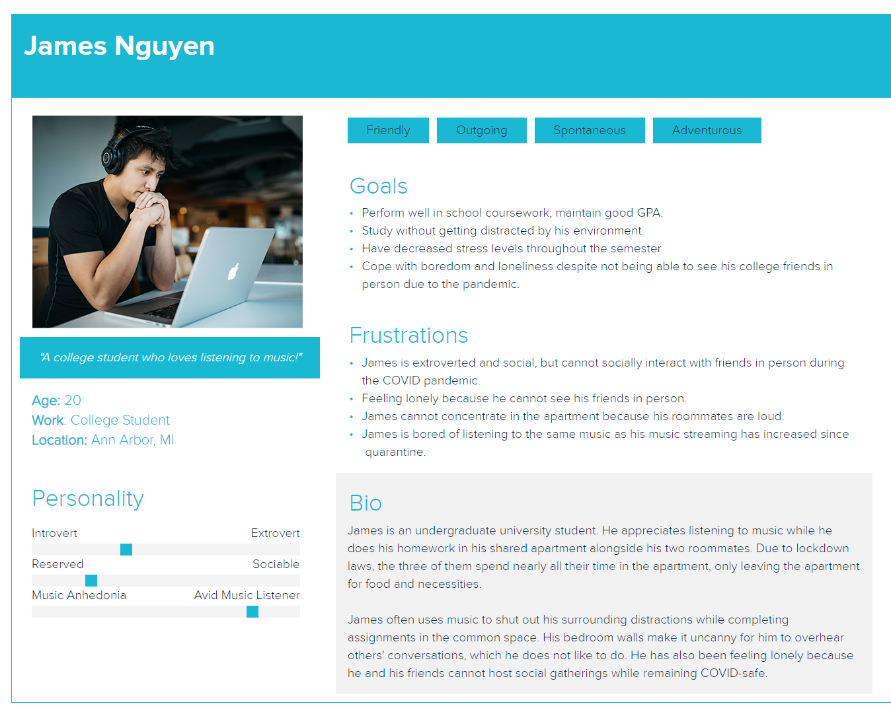
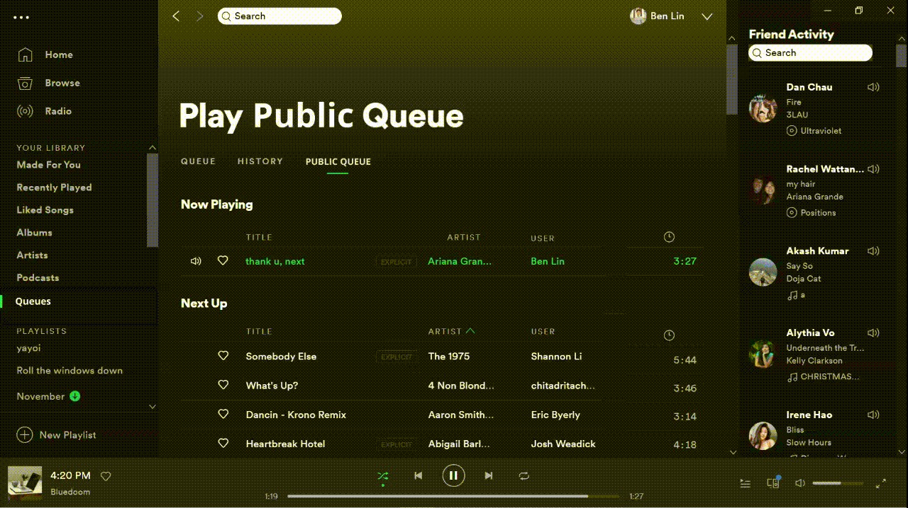
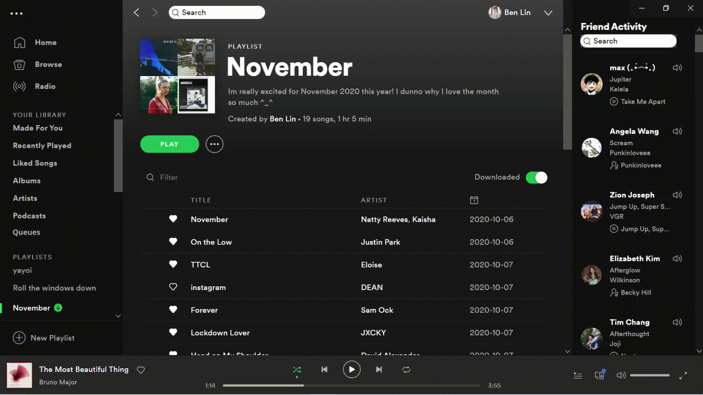

Here are a few of my project highlights from over the past few years.

<a href="#PM_section" class="btn btn-peach">Product Management</a> 
<a href="#SWE_section" class="btn btn-teal">Software Engineering</a> 
<a href="#consulting_section" class="btn btn-purple">Consulting Projects</a>

 
<!-- PM Projects
================================================== -->
<section>
    

        <h1 class = "display-4">Product Management / Design </h1>
    

</section>

<h2> Spotify Public Queue Feature (Fall 2020)</h2>

 The most common PM interview question I get asked is:  
<u><b> "Tell me about your favorite product and what you would change about it" </b></u>
   
I made a <b>mock-up</b> of my response:  
I LOVE Spotify -- a music streaming platform with great features to organize your favorite music, manage playlists, and discover new music. However, it’s social functionality is slightly lacking. Spotify Stories are currently in production and a fan favorite feature is the right column of the webapp -- "Friend Activity". Users love seeing what their friends are listening to in real-time. I built upon this. 

User Research tells us:
<ul> <li>26% of Spotify users are Age 18-24 </li>
<li>29% of Spotify are Age 25-35 </li> </ul>
I started by building a couple user personas. Take James below as a example: a social college student bored in quarantine and missing his friends.

Spotify needs a cleaner way to share songs. Currently, users share a url link via another social media. This is distracting for users. It's more convenient to have song recommendations in a centralized location -- right on the Spotify App.

I designed the workings of a new feature -- a <b> Public Queue </b> to contain all the songs your friends want to drop you. This would have the feel of a shared playlist, so users can see who's recommending which song, with controls to sort it by title, artist, or the user who dropped it. But songs would also pop-off the <u>Public Queue</u> and into <u>History</u>, characteristically of a queue. I made a demo in Figma below!:

 

<h5> Social Feature </h5>
Having a Friend Activity <b>search function </b> on Spotify would both 1) allow users to see what specific friends have last listened to, and 2) create opportunity for song sharing through the familiar Spotify UI. I made demo for this as well below:

Of course, we need a pop-up "Are you sure?" box, in case James drops a song on the wrong person by accident! 

 

<h5> Seamless Integration </h5>
Finally, this needs a little seamless integration! There's two ways users currently add to their private queue. I expanded on both below:

<b> Right-Click </b>

<b> Click-and-Drag </b>

 
<h5> Use Cases</h5>
<ul>
    <li> Parties and other social gathering are accompanied by music. Playing someone's Public Queue would let anyone drop their song requests into aux wordlessly and from their own device.
    </li>
    <li> This feature centralizes song recommendations from several friends into one location -- it's casual and non-disruptive to another social media space.
    </li>
</ul>
Both of these are perfect for our User Persona James, who loves to talk about music and share music between friends. The problem with Spotify's currently beta Group Session is that users can only override the currently playing song, and currently has a 5 person limit.
   

<blockquote class="blockquote">
  

  I used Asana as my Agile Scrum task manager and Figma to design these mockups.   
  The clickable demo can be found
  <a href="https://www.figma.com/proto/jcbpf2iKJn1bSSD6oQyXAW/Spotify-Redesign?node-id=1%3A7&scaling=scale-down" target="_blank"> here.</a>  
  

</blockquote>

 
I created this project as part of the "Out In Tech" Fall 2020 University Mentorship program under the guidance of my mentor, Khoa Ma.

 
<h2><u> Target COVID-19 Store Occupany Tracker (Aug 2020)</u></h2>
<h1> insert image here </h1>

<h6> Hackathon Winner: "Overall Winner" and "Most Technically Challenging" </h6> 

 As part of the Target Diversity Leadership Symposium Conference during August 2020, I worked on a project with 3 teammates to design an app that would help customers locate nearby Target stores and how crowded each store is as it reaches maximum COVID-19 regulated capacity.

<h6> Background </h6>
We created a mock-up of what this application would look like. During events where stores experience overcrowding, employees are often stationed at each entrance to limit customer capacity. The limited occupancy demands of COVID-19 have exacerbated this problem. This Fall 2020 Semester, a new Target store opened up next to UIUC campus, where I was located. Nearly every other day during its first month of opening, there was a line of people waiting outside to enter the store.

<h6> Description </h6>
This app allows users to view nearby Target stores according to the user's GPS location. Store locations are highlighted on a Google Map Services-powered map in color according to occupancy--  
Red: if there is a line of people waiting outside store   Yellow: if the store is approximately at max occupancy   Green: if the store occupancy is not near max occupancy.  

<h2> Insert Map Image here and Demo</h2>

Check out the slides from our presentation <a target="_blank" href="ter.ps/targetHack">here</a>

<!-- close col-md-9 div -->

<h5>Product Management / Design Projects</h5>

 Some of my favorite PM projects where I've practiced thinking like a user-oriented PM. 

<a href="#PM_section" class="btn btn-peach">Product Management</a> 
<a href="#SWE_section" class="btn btn-teal">Software Engineering</a> 
<a href="#consulting_section" class="btn btn-purple">Consulting Projects</a>

<!-- close row justify-content-between -->

 
<!-- SWE Projects
================================================== -->
<section>
    

        <h2> Software Engineering Experience </h2>
    

</section>

<h5> Google STEP Internship - Google Classroom Autograder (Summer 2020)</h5>

 
During my Summer 2020 internship, I worked with two other co-interns to build a Full-Stack Web Application. This application is an autograder for virtual teachers to autograde student coursework submissions on Google Classroom.  

This application used the OAuth for an instructor to login to the website with the same account they use for Google Classroom. We used the Google Classroom API such that the website pulled all the courses, assignments, and submissions from an instructor's Google Classroom account. Next, we created pagination and a frontend for the teacher to view a single students' submission of a worksheet. This frontend allows a teacher to mark out the response area from the student for each question.
 
After each questions' response area has been marked accordingly, the application parses the responses as images from each student. The Google Cloud Vision API is next implemented to parse out the written text. All responses for a single question are converted to Strings, and similar responses to a question are grouped together in buckets. 
 
Finally, the instructor is able to assign a point value to each bucket of responses. This allows for partial grading, for example, all responses with the answer "Rome" can be assigned a 10pt value, while all responses answered "Italy" can be assigned 5pts. This application greatly cuts down on the amount of time a teacher would spend grading each student's answer to each question, as they would now only need to grade each unique response to each question once. 
 

<h6> Technical Specifications </h6>
database design, Google OAuth, Google Classroom API, Google Cloud Vision API, Materialize.css

<h6> What I did </h6>
asdf  
Also, Agile dev design doc writing, code reviews, scope prioritization, roadmapping, and prototyping.  
//Significance with COVID-19

 
<h5> National Institutes of Health Internship (Summer 2019) </h5>

 Machine Learning and stuff. Machine Learning and stuff. Machine Learning and stuff.  
I worked within the Division of Technical Resources at NIH, specifically the Utilities Engineering Branch. NIH has a Central Utility Plant (CUP) on campus to generate hot/cold water and steam for its hospitals and research buildings. I worked primarily in Matlab to improve a model that would predict the amount of utilities that needed to be generated on a given hour. For example, a hot, low-humidity day might require more cold water generation, especially as the load/demand for cold water within the hospital increases. These predictions hypothetically create virtual, predicted savings as the CUP operators could adjust their production accordingly.
   
I also did front-end web development there too! Since I often found myself with time leftover, I picked up a secondary project -- working on the dynamic web pages of a website used to in Angular to do perform a datapull from the PI OSIsoft internal database in a convenient UI for the operators to act off of.
 
My cointerns, Marissa, Alex, and I pictured below:

  
<h5> HackUMBC - Cardiac Connection (Fall 2019) </h5>

 I competed in  HackUMBC Fall 2019! I built an app similar to Tinder, but with a bit more HCI (Human-Computer Interaction) pushed into it.  
At this particularly hackathon, the majority of the sponsors had come up with challenges such as "Best Data Visualization Hack" or something along those lines. But none of them provided a dataset, and I didn't want to waste time at a 24-hour hackathon doing data mining and cleansing.  

So instead, my two friends and I decided to throw something together a little more fun! We built a Javascript App using Cordova, which allowed us to demo on either Android or iOS. This application allowed users to swipe either left or right on card profiles, containing a person's photo and short bio. I also utilized the Google Cloud API -- GCP datastore buckets to store these profiles and fetch them for the app.  

We also built a Fitbit App, which would take note of your heart rate. This would be used to ping the mobile app on someone's device to automatically swipe right when the users' heart rate escalates.  

<h6> Next Steps </h6>
Unfortunately, this is only a 24-hour hackathon, so of course features went unfinished. Our next step would include an interface for users to build their own profile, rather than simply swiping on other profiles. Another feature to implement would be real-time chat.  
The Fitbit would not communicate, however, because using the Fitbit API requires someone to manually review the request to utilize it. Because we overlooked this at the start of our project design, we were unable to get access to use the API in time. A next step would be incorporating the Fitbit and Mobile apps to communicate.

Check out the devpost from the hackathon <a target="_blank" href="https://devpost.com/software/cardiac-chemistry">here</a>

<!-- close col-md-5 div -->

<h5>Software Engineering Projects</h5>

 These are some of my favorite SWE projects. beep boop. 

<a href="#PM_section" class="btn btn-peach">Product Management</a> 
<a href="#SWE_section" class="btn btn-teal">Software Engineering</a> 
<a href="#consulting_section" class="btn btn-purple">Consulting Projects</a>

<!-- close row justify-content-between -->

 
<!-- Consulting Projects
================================================== -->
<section>
    

        <h2> Consulting Experience </h2>
    

</section>

<h5> Expressions Kenya (Fall 2020) </h5>

 Stuff about Expressions and what I did. Stuff about Expressions and what I did. Stuff about Expressions and what I did. Stuff about Expressions and what I did. Stuff about Expressions and what I did. Stuff about Expressions and what I did. Stuff about Expressions and what I did. Stuff about Expressions and what I did. Stuff about Expressions and what I did. Stuff about Expressions and what I did. Stuff about Expressions and what I did.  

   
<h5> Captial Area Food Bank - Data Analytics (Spring 2020) </h5>

 
The Capital Area Food Bank (CAFB) is one of the largest Food Banks in the mid-atlantic region. They serve 380,000 individuals in the DC, MD, and VA area. My team consisting of 3 other team members and myself, were tasked with optimizing their impact by identifying areas of greatest opportunity. 
 
The CAFB has 450+ Food Assistance Partners. This includes emergencies, soup kitchens, senior programs, among others. Given the census tract data on the area, we used Python to identify outlier areas of underserved populations where the CAFB can potentially reallocate resources. Due to the COVID-19 pandemic, implementing any of these changes has been delayed. However, please view the poster below as our provided recommendations.
 
insert information on data sources -- CAFB Distribution Location data, Census Socioeconomic Data, folium data visualization

<h5>Consulting Projects</h5>

 I'm part of the QUEST Honors Program at the University of Maryland! As part of the program, I've worked in teams on these projects with Engineerings, CMNS, and Business students to consult for various organizations. 

<a href="#PM_section" class="btn btn-peach">Product Management</a> 
<a href="#SWE_section" class="btn btn-teal">Software Engineering</a> 
<a href="#consulting_section" class="btn btn-purple">Consulting Projects</a>

<!-- close row justify-content-between -->

